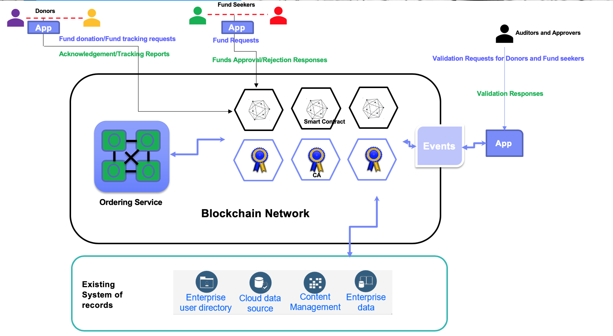
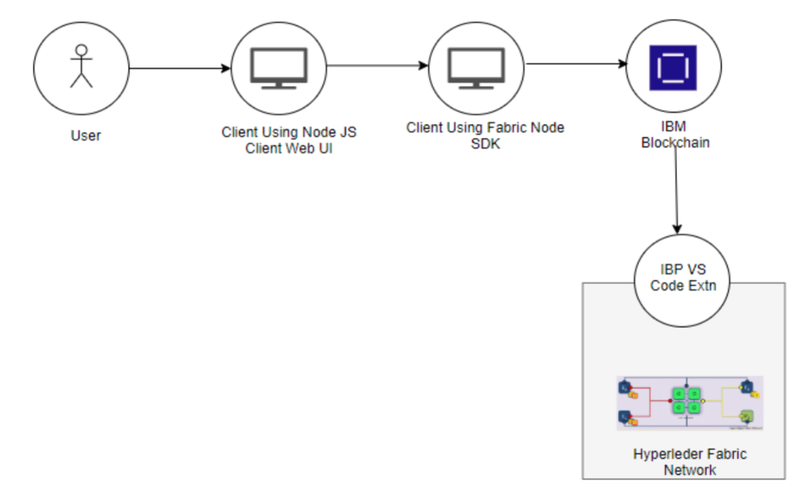
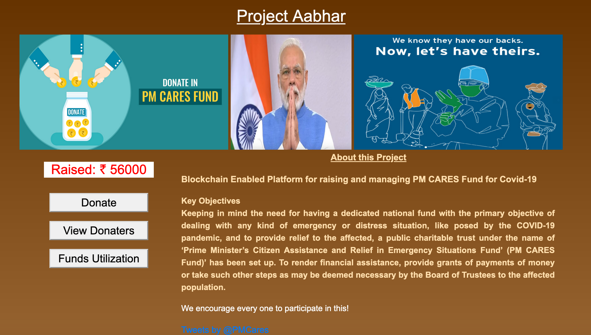

# PMCaresDonationTracking
**Blockchain Based application to track PM Care fund**

Our proposed solution will help in managing and tracking donations made to PMCares fund therefore adding transparency, removing intermediaries and providing real-time audit trails of funds utilization.

### High-Level Design



### Flow Diagram



### Steps

Please follow the steps to run this application.

* Clone the code
* Setup IBP extension on VS Code
* Get connection profile and copy to `local` directory provided in github repository.
* To start the server, perform the following steps.

  ```
  cd backend
  npm install
  PORT=30001 DEPLOY_TYPE=local npm start
  ```
* Run the webapp.
  ```
  cd webapp
  npm install
  npm start
  ```
* Access the application

You can access the webapp at `http://localhost:3000`. You should see the following on your browser.



Using this application you can monitor the funds raised, donate the money, view the contributors and also track the utilization of funds.
